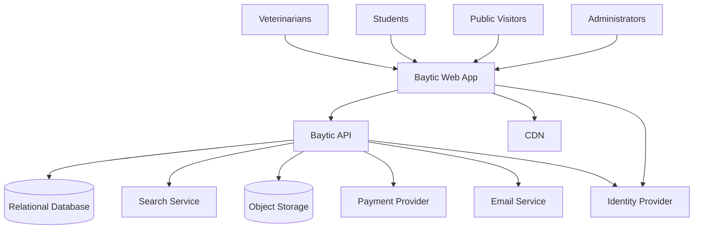
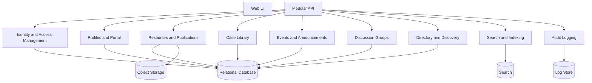
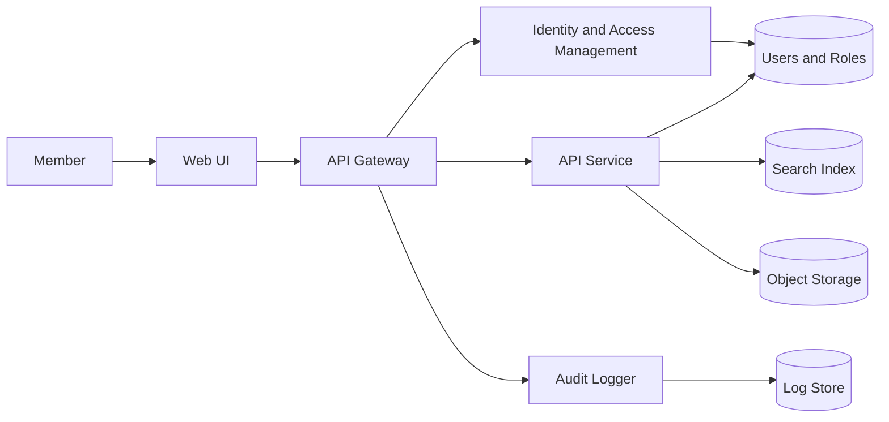
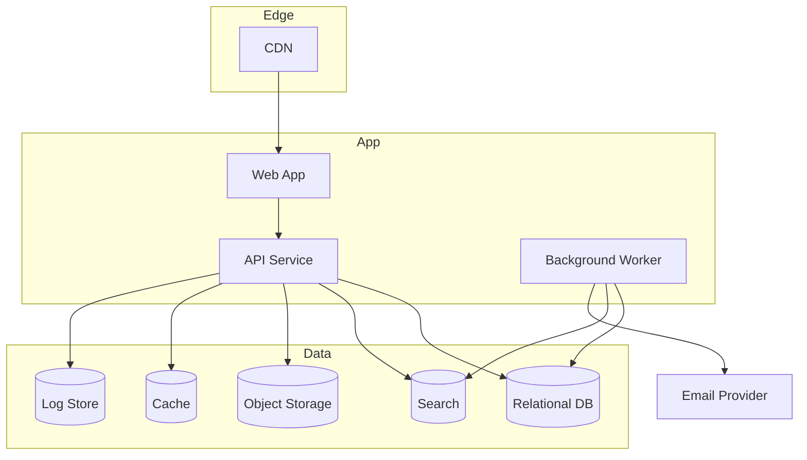
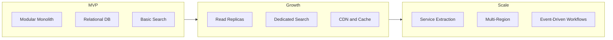
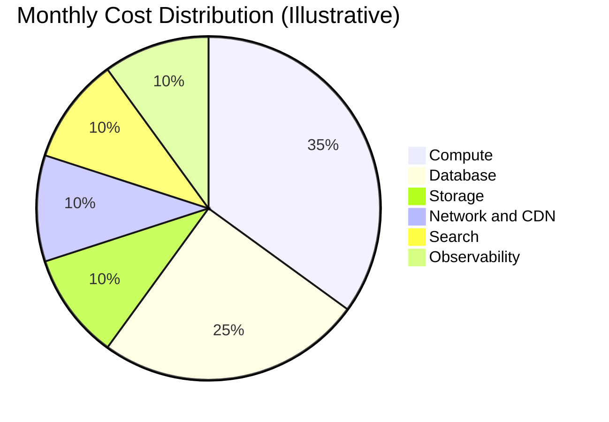

# Baytic - Architecture Plan

## Executive Summary
Baytic will ship as a modular monolith optimized for a 12 to 16 week MVP. This approach balances speed, team size (5 to 7), and clear domain boundaries while keeping future service extraction possible. The architecture prioritizes trusted content delivery, role-based access, search, and community workflows with a cloud-agnostic deployment model.

## Discovery Summary
- Primary users: veterinarians, students, clinics, researchers, and public visitors.
- MVP scope: membership and portal (Phase 1), resources and publications (Phase 2).
- Non-goals: telemedicine, native mobile apps, AI diagnostics.
- Core integrations: authentication, payments, email notifications.
- Compliance: privacy controls, audit logging, data access and deletion requests.
- Success metrics: membership conversion, CE completion, search success rate, uptime.

## Architecture Style
### Option A: Modular Monolith (Recommended)
- Best for MVP and small team with clear domain boundaries.
- Lower operational overhead, simpler deployments.
- Enables future extraction of services (content, search, community) as scale grows.

### Option B: Microservices
- Strong isolation and scaling per domain.
- Higher operational complexity and DevOps overhead.
- Risky for MVP timeline and team size.

Recommendation: Modular monolith with strict domain modules, explicit APIs, and a background worker layer for async tasks.

## Technology Stack (Cloud Agnostic)

### Evaluation Matrix

| Criterion | Weight | Frontend | Backend | Database |
|-----------|--------|----------|---------|----------|
| Team Fit | High | Vue strong ecosystem | .NET | PostgreSQL expertise |
| Ecosystem Maturity | High | Excellent | Excellent | Excellent |
| Scalability | High | CDN-friendly | Modular design | Replicas, sharding |
| Cost of Ownership | Medium | Moderate | Moderate | Reasonable |
| Hiring Market | Medium | Strong market | Strong market | Standard skill |
| Performance | Medium | Good (SSR) | Good (REST) | Good (tuned) |
| Security Posture | Medium | Well-maintained | Industry-standard | Built-in roles |
| Vendor Lock-in Risk | Low | None | None | None |

### Frontend
- **Primary**: Vue.js with server-rendered framework (Nuxt for SSR and SEO optimization).
- **Rationale**: Both enable SEO-friendly rendering of public content, support incremental adoption, and have large talent pools.

### Backend
- **Primary**: .NET (C# ASP.NET Core) for type safety, performance, and enterprise tooling.
- **Rationale**: Either choice enables clean module structure and REST APIs. Language choice depends on team expertise.

### Database
- **Primary**: PostgreSQL for relational data, RBAC, JSON, full-text search, and managed service availability.
- **Alternative**: Managed relational database (Azure Postgres, GCP Cloud SQL) for reduced ops burden.
- **Rationale**: PostgreSQL is battle-tested, extensible, and cost-effective. Full-text search is built-in.

### Search
- **MVP**: PostgreSQL full-text search (GIN index) for resources, case library, and directory.
- **Rationale**: Start simple, extract when bottleneck emerges. Avoids over-engineering.

### Storage
- **Object Storage**: Azure Blob Storage for publications, media assets, and file uploads.
- **Rationale**: Managed service reduces ops, enables CDN integration, provides durability.

### Caching
- **In-Memory Cache**: Redis or similar for sessions, frequently accessed content, and rate limiting.
- **Rationale**: Improves response times for authenticated users. Simple to operate at MVP scale.

### Messaging & Jobs
- **Job Queue**: Hangfire (.NET), or managed task queue for async work.
- **Use cases**: Email notifications, search indexing, content publishing audit trail, CE credit updates.
- **Rationale**: Decouples request handlers from slow operations. Retryable and auditable.

### Observability
- **Logs**: Centralized logging (e.g., Azure Monitor with Grafana) with audit trail for compliance.
- **Metrics**: Application metrics (request latency, error rates, search QPS) with alerting.
- **Traces**: Optional; prioritize when latency issues emerge.
- **Rationale**: Start simple; add observability depth as complexity increases.

## System Architecture
### System Context Diagram


### Component Diagram


### Data Flow Diagram


### Deployment Diagram


### Scalability Evolution Diagram


### Cost Breakdown Diagram


## Scalability Roadmap

### Phase A - MVP (0 to 1K users, Weeks 0–16)

**Infrastructure**:
- Modular monolith on single compute instance or container cluster.
- Single PostgreSQL instance (managed service for automatic backups).
- Redis for sessions and content caching.
- Object storage with Azure Blob Storage for asset delivery.
- Job queue for async work (email, indexing).

**Database**:
- Single relational schema with logical module ownership.
- Full-text search via PostgreSQL GIN indexes.
- Audit logging to separate tables.

**What you'll build**:
1. **Phase 1**: Membership, authentication, portal, role-based access.
2. **Phase 2**: Resources, case library, publications, search.
3. **Phase 3**: CE tracking, credentials, events.
4. **Phase 4**: Community discussion groups, directory, moderation.

**Scaling challenges at 1K users**: None. System is idle most of the time.

---

### Phase B - Growth

**What changes**:
- Read replicas for database to handle increased query load.
- Dedicated search service (OpenSearch) to offload indexing and full-text search from primary database.
- Multi-tier caching: object cache (Redis) + HTTP cache (CDN with longer TTL).
- Background worker pool scaled independently for content publishing and email.
- API rate limiting and throttling per role.

**Database**:
- Primary–replica setup; reads go to replicas, writes to primary.
- Use connection pooling (PgBouncer) to limit connection overhead.
- Consider read-only views for public content queries.

**Search**:
- Migrate from PostgreSQL full-text to dedicated OpenSearch cluster.
- Index updates via async job queue to avoid blocking writes.

**Caching Strategy**:
- Cache resource listings for 5–15 minutes (public content is stable).
- Cache directory search results for 10 minutes.
- Cache CE tracking and member profiles (short TTL, 1–2 minutes due to frequent updates).

**Cost optimization**:
- Use reserved capacity for compute and database if scaling trajectory is clear.
- Consider managed database auto-scaling or on-demand replicas.

**Scaling challenges at 100K users**: 
- Database write latency (too many concurrent CE credit updates, event registrations).
- Search indexing lag if content publishing is high.
- CDN cache miss rate on large content libraries.

---

### Phase C - Scale

**What changes**:
- Decompose monolith: extract search, community, directory into independent services.
- Multi-region deployment with regional read replicas and eventual consistency for non-critical data.
- Event-driven architecture: publish content changes to message bus; subscribers index, notify, audit.
- Specialized query engines for analytics (data warehouse) separate from transactional database.
- Advanced caching: cache warming, predictive caching for trending content.

**Database**:
- Multi-region active–passive: primary writes in one region; read replicas globally.
- Consider database sharding if single database write throughput maxes out (monitor with metrics first).
- Use prepared statements and query optimization tools (e.g., pgBadger, EXPLAIN ANALYZE).

**Service Extraction**:
1. **Search Service**: Independent OpenSearch cluster, APIs for indexing and querying. Content service calls search APIs.
2. **Community Service**: Separate schema for discussion, moderation, and notifications. Call via async message queue for decoupling.
3. **Directory Service**: Isolated APIs for clinic and specialist lookups. Cache aggressively.

**Event-Driven Patterns**:
- Content published: emit event → search service indexes, audit logger records, notifier sends email.
- CE credit issued: emit event → member profile service updates, email notifier sends confirmation.
- User registered: emit event → profile service creates record, email notifier sends welcome.

**Cost optimization**:
- Serverless compute for bursty workloads (job processing, email sending).
- Data tiering: cold storage for historical audit logs.
- Reserved capacity for predictable baseline load.

**Scaling challenges at 1M users**: 
- Geographic latency: deploy compute closer to users (CDN for static, regional services for dynamic).
- Third-party API limits: payment processing, email sending (add queuing and retry logic).
- Compliance and data residency: multi-region architecture with data sovereignty concerns.

## Best Practices and Patterns

### Domain-Driven Design (DDD) Boundaries

Baytic is organized into clear domain modules at the API layer. Respect these boundaries in code:

1. **Membership Domain**
   - Ownership: Handles authentication, user registration, role assignment.
   - Contracts: managed by Keycloak.
   - Database tables: managed by Keycloak.

2. **Portal Domain**
   - Ownership: Member profiles, preferences, saved resources.
   - Contracts: `GET /members/{id}/profile`, `PUT /members/{id}/profile`, `GET /members/{id}/saved-resources`.
   - Database tables: `member_profiles`, `saved_resources`.

3. **Content Domain** (Resources, Publications)
   - Ownership: Guidelines, toolkits, publications lifecycle (draft, review, published).
   - Contracts: `GET /resources`, `POST /resources` (admin only), `PUT /resources/{id}`, `GET /publications`.
   - Database tables: `resources`, `publications`, `resource_tags`, `audit_log`.

4. **Case Library Domain**
   - Ownership: Case submissions, peer review, case browsing.
   - Contracts: `GET /cases`, `POST /cases` (members), `GET /cases/{id}/comments` (members only).
   - Database tables: `cases`, `case_comments`, `case_reviews`.

5. **Search Domain**
   - Ownership: Search indexing, querying. Can be database (MVP) or dedicated service (growth+).
   - Contracts: `GET /search?q={query}&type={resources|cases|publications}`.
   - Storage: PostgreSQL GIN or OpenSearch index.

6. **Community Domain**
   - Ownership: Discussion groups, moderation, mentorship matching.
   - Contracts: `GET /groups`, `POST /groups/{id}/messages` (members).
   - Database tables: `discussion_groups`, `group_messages`, `moderation_queue`.

7. **Events & Announcements Domain**
   - Ownership: Events calendar, registrations, announcements.
   - Contracts: `GET /events`, `POST /events/{id}/register`, `GET /announcements`.
   - Database tables: `events`, `event_registrations`, `announcements`.

8. **Directory Domain**
   - Ownership: Clinic and specialist directory, location-based search.
   - Contracts: `GET /directory?specialty={}&location={}`, `GET /directory/{id}`.
   - Database tables: `directory_listings`, `specialty_tags`.

9. **Audit & Compliance Domain**
   - Ownership: Audit logging for admin actions, content changes, data access.
   - Contracts: Internal only; writes from all domains.
   - Database tables: `audit_logs`.

---

### RBAC (Role-Based Access Control)

**Enforce at every endpoint**. Example:

```pseudocode
GET /resources/{id}
  If public resource: allow all
  If member-only resource: require role in ['veterinarian', 'student', 'admin']
  If restricted resource: require ownership or admin
```

**Roles**:
- `public`: No login required. Sees public resources, announcements, public listings.
- `student`: Student member. Sees learning paths, selected resources. Cannot access veterinarian-only content.
- `veterinarian`: Professional member. Full resource access, case library, CE tracking, directory.
- `admin`: Can publish content, manage members, moderate, view audit logs.

---

### API Design

**Consistency**:
- All endpoints return JSON with metadata (e.g., `{ data: {...}, meta: { timestamp, version } }`).
- Error responses: `{ error: { code, message, details } }`.
- Pagination: `?page=1&pageSize=20` with `meta: { total, page, pageSize }`.

**Versioning**:
- URL versioning: `/api/v1/resources`, `/api/v2/resources` (for breaking changes).
- Avoid frequent major versions. Deprecate old versions 6 months in advance.

**Search Filters**:
- Resources: `?specialty=small_animal&species=canine&status=published`.
- Cases: `?specialty=cardiology&species=feline`.
- Pagination on all list endpoints to avoid memory bloat.

---

### Async Patterns

Use background workers (job queue) for:
- Email notifications (signup, CE completion, announcements).
- Search indexing (after content publish/update).
- CE credit batch processing (monthly or event-triggered).

**Implementation**:
- Job queue library (Hangfire).
- Idempotent handlers (jobs can run >1 time safely).
- Exponential backoff for failures; alert after 3 retries.
- Dead-letter queue for failed jobs; manual review.

---

### Data Consistency Model

**Strong consistency**:
- User authentication, role changes, member profile updates.
- Critical: use synchronous writes to primary database.

**Eventual consistency**:
- Search index updates (can lag by minutes).
- Cache invalidation (can serve stale data briefly).

**Implementation**:
- Use transactions for multi-table updates (e.g., publish resource + audit log).
- Use database-level foreign keys to prevent orphaned data.
- Test data consistency in integration tests.

## Security Architecture

### Authentication & Authorization

**Auth Provider**: Choose managed service or build minimal in-house.
- **Managed (recommended)**: Keycloak.
  - Pros: Built-in MFA, session management, compliance logging.
  - Cons: Vendor lock-in, per-user costs at scale.
- **Custom minimal**: Local username/password with bcrypt + JWT tokens.
  - Pros: Full control, no vendor fees.
  - Cons: Compliance burden (PSD, GDPR), security risks if not done carefully.

**Recommendation**: Use managed service for MVP. Reduces compliance complexity and accelerates delivery.

**Session Management**:
- Store JWT in secure, HttpOnly cookie (not localStorage).
- Token TTL: 1 hour; refresh token TTL: 30 days.
- Refresh token rotation: issue new refresh token on each refresh.
- Log all authentication events (success and failure) for audit.

---

### Authorization (RBAC + Ownership)

**Rule**:
```
For each action (read, write, delete):
  1. Check role (public, student, veterinarian, admin).
  2. Check ownership (e.g., member can only edit own profile).
  3. Check resource visibility (e.g., draft content not visible to public).
```

**Example: POST /resources/{id} (Update a resource)**:
```
- Admin: always allowed.
- Veterinary: allowed if owner and status is draft.
- Student: not allowed.
- Public: not allowed.
```

---

### Data Protection

**Encryption in Transit**:
- All APIs over HTTPS (TLS 1.2+).
- Enforce HSTS header: `Strict-Transport-Security: max-age=31536000`.

**Encryption at Rest**:
- Database: Enable encrypted storage.
- Object storage: Use default server-side encryption (Azure Storage encryption).
- Secrets: Use managed secret store (Azure Key Vault).

**Data Minimization**:
- Store only required fields in member profiles: email, name, specialty, subscription tier.
- Avoid storing credit card numbers; use payment processor tokens.
- Purge old audit logs after 7 years (or per regulation).

**Data Access & Deletion**:
- Implement `DELETE /members/{id}` endpoint.
- Log all data access attempts in audit trail.

---

### Audit Logging & Compliance

**Capture**:
- All authentication events (login, logout, password reset, MFA changes).
- All admin actions (create user, change role, publish content, moderate comments).
- All write operations (create, update, delete) with before/after values.

**Storage**:
- Immutable append-only log (cannot update/delete).
- Retention: 7 years (depends on regulations).

---

### Threat Model

**Identified Threats**:

1. **Unauthorized Access to Member Data**
   - Mitigation: RBAC + ownership checks, encryption at rest, audit logging.

2. **Search Index Poisoning**
   - Mitigation: Validate input, sanitize before indexing, rate limit submissions.

3. **DDoS on Public Content Endpoints**
   - Mitigation: CDN caching, rate limiting, WAF (if using cloud provider).

4. **Third-party API Compromise (Auth, Payment)**
   - Mitigation: Use managed services with SLAs, token rotation, audit logging of API calls.

---

### Compliance Checklist (MVP)

- [ ] Privacy policy drafted and published.
- [ ] GDPR data export endpoint implemented.
- [ ] GDPR delete (soft) endpoint implemented.
- [ ] Auth over HTTPS with secure cookies.
- [ ] Database encryption enabled.
- [ ] Secrets management system in place.
- [ ] Incident response plan drafted (who to contact if breach occurs).
- [ ] Data retention policy defined (how long we keep data).
- [ ] Third-party sub-processors listed (Keycloak, SendGrid, etc.).

## Risks and Mitigations

| Risk | Impact | Probability | Mitigation | Owner |
|------|--------|-------------|-----------|-------|
| **Content Quality Bottleneck** | Delayed publication, member churn | Medium | Define minimal review SLA (e.g., 48 hrs). Train reviewers. Phase 2 pre-task. | Product |
| **Taxonomy Sprawl** | Search confusion, maintenance burden | Medium | Limit to 5–10 primary tags MVP. Expand post-launch based on usage. | Product |
| **Access Control Bugs** | Security breach, compliance violation | Medium | Unit test all RBAC rules. Integration tests for cross-domain access. Audit log verification tests. | Engineering |
| **Database Write Bottleneck** | Latency spikes during events | Low (MVP) → High (100K+) | Monitor write latency. Plan read replicas for growth phase. | Engineering |
| **Search Latency** | Poor UX for resource discovery | Low (MVP) → Medium (100K+) | Monitor search QPS and latency. Migrate to OpenSearch if PG QPS > 500 reads/sec. | Engineering |
| **Auth Provider Outage** | Login unavailable, users locked out | Low | Use managed service with 99.9% SLA. Test fallback strategy. | Product |
| **Data Privacy Violation** | GDPR fine, reputation damage | Low | Implement data export/delete, audit logging. Compliance review before launch. | Legal + Engineering |
| **Insufficient Audit Logging** | Compliance failure, post-breach investigation impossible | Medium | Design audit schema early (Phase 1). Log all auth and admin actions. | Engineering |
| **Vendor Lock-in** | High switching cost if provider fails | Low (MVP) | Use standard APIs (REST, HTTPS). Document all integrations (Auth, Payment, Email). | Architecture |

---

## Architecture Decision Records

- [ADR-001: Modular Monolith Architecture](./architecture/ADR-001-modular-monolith.md)

Future ADRs as project evolves:
- ADR-002: Relational Database Normalization and Schema Design
- ADR-003: Search Strategy (PostgreSQL FTS vs OpenSearch migration)
- ADR-004: Authentication Provider Selection (Managed vs Custom)
- ADR-005: Async Job Queue Design (Bull, Hangfire, or equivalent)

---

## Next Steps

### Immediate (Next Sprint)

1. **Confirm Membership Tiers & Pricing**
   - Finalize tier definitions (student, professional, premium).
   - Align pricing model with business team.

2. **Choose Auth Provider**
   - Evaluate Keycloak.
   - Create comparison matrix (cost, compliance features, integration time).
   - Recommend and decide.

3. **Define Initial Taxonomy**
   - List 5–10 primary specialties (small animal, large animal, exotic, etc.).
   - List 5–10 primary species (canine, feline, equine, avian, etc.).
   - List review statuses (draft, submitted, approved, published, archived).

### Phase 1 Planning (Weeks 2–4)

4. **Database Schema Design**
   - Design tables for users, roles, members, profiles.
   - Design content log tables (extensible for Phase 2).

5. **API Specification**
   - OpenAPI (Scalar) spec for auth, membership, profiles endpoints.
   - Version endpoints as `/api/v1/...`.

6. **Frontend Design System**
   - Create Figma component library (buttons, forms, cards, layout).
   - Establish accessibility baseline (WCAG 2.1 AA).

### Phase 1 Execution

7. **Phase 1 Development**
   - Auth service, profile service, membership portal.
   - See [plan.md](./plan.md) for detailed workstreams.

### Phase 2 Planning

8. **Content Strategy**
   - Define submission workflow (who can submit, review process, approval SLA).
   - Establish editorial guidelines and quality standards.
   - Identify initial content reviewers.

9. **Search Implementation Plan**
    - Decide on PostgreSQL full-text search rules.
    - Design indexing strategy (real-time vs background batch).
    - Create test data sets for search quality validation.

---

## Appendix: Architecture at a Glance

**System**: Baytic Veterinary Platform  
**Scale (MVP)**: 0–1K users, 1000 API req/day  

**Core Architecture**: Modular monolith (single deployment, clear domain modules)  

**Tech Stack**:
- Frontend: Nuxt.js
- Backend: .NET/ASP.NET Core (REST APIs)
- Database: PostgreSQL (managed service)
- Search: PostgreSQL full-text search (GIN index)
- Storage: Object storage (Azure Blob)
- Cache: Redis (in-memory)
- Job Queue: Hangfire (.NET)
- Auth: Managed service (Keycloak)
- Observability: Azure Monitor + Grafana (logs, metrics)

**Deployment**: Cloud-agnostic (container-based, Kubernetes optional at scale)  

**Scaling Path**: MVP monolith → Growth (read replicas + dedicated search) → Scale (service extraction + multi-region)  

**Key Risks**: Content quality bottleneck, access control bugs, search latency (all mitigated with planning and testing)