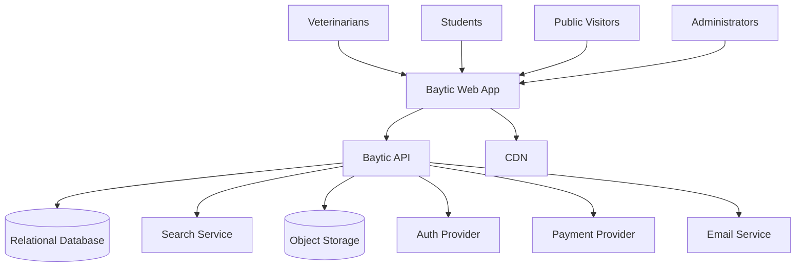
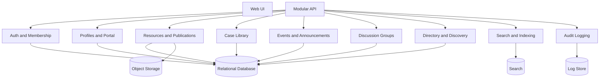
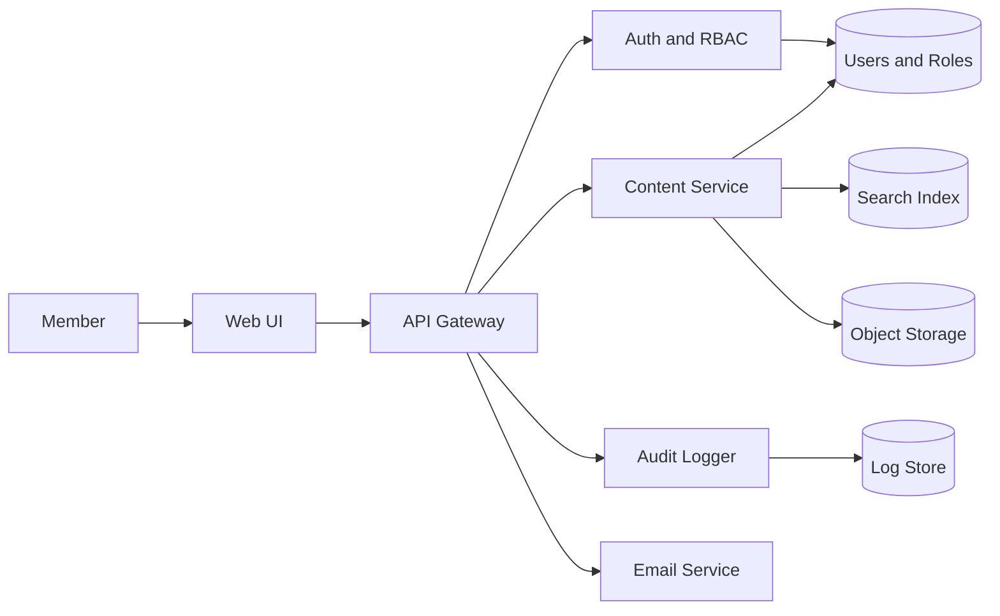
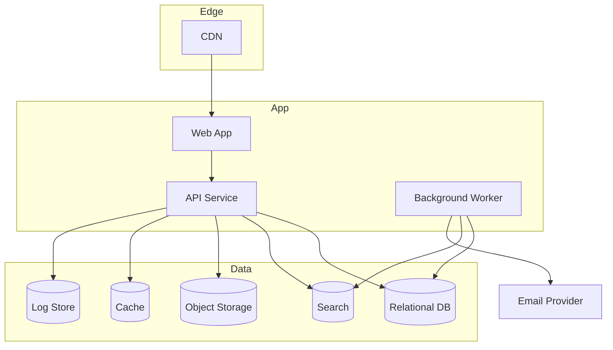
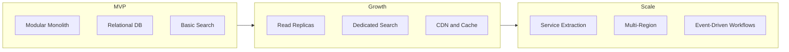
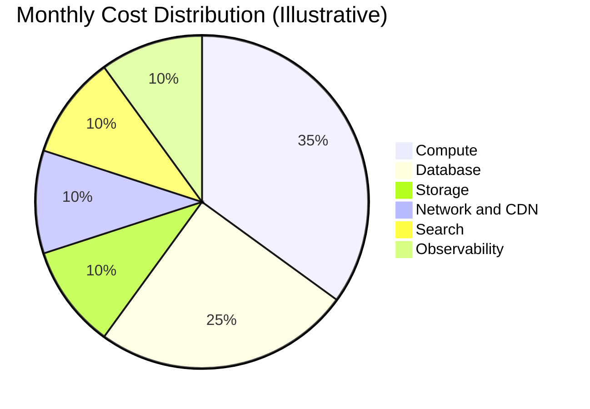

# Baytic - Architecture Plan

## Executive Summary
Baytic will ship as a modular monolith optimized for a 12 to 16 week MVP. This approach balances speed, team size (5 to 7), and clear domain boundaries while keeping future service extraction possible. The architecture prioritizes trusted content delivery, role-based access, search, and community workflows with a cloud-agnostic deployment model.

## Discovery Summary
- Primary users: veterinarians, students, clinics, researchers, and public visitors.
- MVP scope: membership and portal (Phase 1), resources and publications (Phase 2).
- Non-goals: telemedicine, native mobile apps, AI diagnostics.
- Core integrations: authentication, payments, email notifications.
- Compliance: privacy controls, audit logging, data access and deletion requests.
- Success metrics: membership conversion, CE completion, search success rate, uptime.

## Architecture Style
### Option A: Modular Monolith (Recommended)
- Best for MVP and small team with clear domain boundaries.
- Lower operational overhead, simpler deployments.
- Enables future extraction of services (content, search, community) as scale grows.

### Option B: Microservices
- Strong isolation and scaling per domain.
- Higher operational complexity and DevOps overhead.
- Risky for MVP timeline and team size.

Recommendation: Modular monolith with strict domain modules, explicit APIs, and a background worker layer for async tasks.

## Technology Stack (Cloud Agnostic)
### Frontend
- Primary: React with server-rendered framework for SEO and content performance.
- Alternative: Vue with server-rendered framework for similar benefits and team fit.

### Backend
- Primary: Node.js or .NET API in a modular monolith with REST endpoints.
- Alternative: Java Spring Boot if team expertise aligns.

### Database
- Primary: PostgreSQL for relational data, permissions, and search metadata.
- Alternative: Managed relational database with compatible SQL features.

### Search
- MVP: PostgreSQL full-text search for resources and directory.
- Growth: Dedicated search service (OpenSearch or Elastic) for scale.

### Storage
- Object storage for publications and media assets.

### Caching
- In-memory cache for session and hot content (Redis or equivalent).

### Messaging
- Lightweight job queue for email, indexing, and scheduled tasks.

### Observability
- Centralized logs, metrics, and tracing with alerting on auth, content publishing, and search latency.

## System Architecture
### System Context Diagram


### Component Diagram


### Data Flow Diagram


### Deployment Diagram


### Scalability Evolution Diagram


### Cost Breakdown Diagram


Link: [View Interactive Diagrams](./baytic-architecture-diagrams.html)
Link: [Edit in Draw.io](./baytic-architecture.drawio)

## Scalability Roadmap
### Phase A - MVP (0 to 1K users)
- Modular monolith with clear domain modules.
- Single relational database.
- Search via database full-text.
- Async jobs for email and content indexing.
- CDN for static assets and publications.

### Phase B - Growth (1K to 100K users)
- Add read replicas and caching for hot content.
- Introduce dedicated search service.
- Add job queue and worker autoscaling.
- Expand observability and alerting.

### Phase C - Scale (100K+ users)
- Extract search and community into independent services.
- Multi-region deployment with regional read replicas.
- Event-driven pipelines for content publishing and audit.
- Advanced caching tiers and global CDN routing.

## Cost Analysis (Cloud Agnostic)
```
Monthly Cost Estimate
----------------------------------------
Component        MVP     Growth   Scale
Compute          $__     $__      $__
Database         $__     $__      $__
Storage          $__     $__      $__
Network and CDN  $__     $__      $__
Observability    $__     $__      $__
Third-party      $__     $__      $__
----------------------------------------
TOTAL            $__     $__      $__
```

Top cost drivers are compute, database, and search as content volume and usage grow.

## Best Practices and Patterns
- Domain boundaries: membership, content, community, events, directory.
- RBAC at every endpoint with ownership checks.
- Content versioning with audit trails.
- Use async jobs for indexing and notifications.
- Prefer API-first design and consistent metadata across resources.

## Security Architecture
- Central auth provider with RBAC and least privilege.
- Audit logging for admin and content changes.
- Encryption in transit and at rest for member data.
- Secure object storage with time-limited access for downloads.

## Risks and Mitigations
- Content quality bottleneck: establish minimal review workflow and escalation rules.
- Taxonomy sprawl: limit initial tags and expand post-MVP.
- Access control complexity: document roles and build a test matrix.

## Architecture Decision Records
- [ADR-001 Modular Monolith](./architecture/ADR-001-modular-monolith.md)

## Next Steps
1) Confirm membership tier definitions and pricing.
2) Choose auth and payment providers.
3) Define initial taxonomy and content governance.
4) Align on MVP hosting provider and deployment workflow.